- [x] Joints
- [x] Collisions
The layer of cells which coers the cerebral helisphere - cerebral c ortex
- [ ] Neural contrl and coordination
- [ ] Non cyclic Phosphorylation (Photosynthesis)
- [ ] Molecular Basis of Inheritance (Transcription)
- [x] [[Nucleus]] (Ch: Cell The Unit of lIife)
- [x] [[Transciption and Translation occuring simultaneously in bacteria]] 
- [ ] Life Cucle
- [x] Virions
- [ ] [[Floral Families]] 
- [x] Sexual Reproduction in Flowering Plants (Ploidy) - Embryo sac
- [x] Cell Cycle and Cell Division (Cytokinesis) [[Cytokinesis]]
- [x] [[Required for synthesis of auxin]]
- [ ] Sickle cell anemia
- [x] [[Turner's syndrome]]
- [x] To oxidise 1 mol FeSO4 how many moles of  *a*cidic K2Cr2O7 are required?
	- 
- [ ] Borax
- [x] Stability of carbocations
- [ ] Water soluble and fat soluble vitamins
- [ ] Total charge required to reduce 1 mole of MnO−4 to Mn+2 ions is
- [ ] If equivalent mass of a metal ' M ' is 12 , molar mass (in g) of its sulphate MSO4 would be
- [ ] pH of mixture of 500 ml 0.1 M CH3COOH and 250 ml 0.1 M NaOH solution is
(given pKa of acetic acid is 4.74 )
- [ ] Diagonal relationshio
- [ ] Molar solubility of AgCl at 25 ∘C is 1×10−5 mol/L. Its solubility in 0.05 M NaCl solution is
- [ ] In the following balanced equation,

ratio of b to c is 
- [ ] Bond energy of halogens
- [ ]  1 L of $CH_4$ gas at STP weighs
- [ ] Activation Energy
- [ ] Factors affecting equilibrium
- [ ] In a moderately doped P-type semiconductor, the fermi energy level lies
- [ ] A boy has 50 kg mass. He wants to float in river with the help of a wooden log. If relative density of wood is 0.8, then the minimum volume of wooden log would be
- [ ] Guddu and his brother Bablu race up a hill. Guddu weight twice as much as Bablu and takes twice as long as Bablu to reach the top of the hill. Compared to Bablu

- [ ] Current i is carried in a wire of length L. If the wire is turned into a circular coil. The maximum magnitude of torque acting on it, when placed in a given uniform magnetic field B, will be
- [ ] 57, 35 trick triangle 
- [ ] Zener diode
- [ ] ATPase activity 
- [ ] Urine formation
- [ ] Biomolecules Composition table
- [x] [[Secretin]]
- [x] Which part of the pituitary is under direct neural regulation of hypothalamus? [[Posterior hypothalamus]]
- [ ] How many of the side effects given in the box below are related to usage of anabolic steroids in males only?
Breast enlargement, enlargement of prostate gland, stunted growth, excessive hair growth on head, deepending of voice
(Chemical Control and Integration)
- [ ] [[Oogenesis]]
- [ ] Transgenic protein α-1-antitrypsin helps in the treatment of: (Transgenic animals)
- [ ] rNAi 
- [ ] Choose the structure not found in a male cockroach.
(Anal styles, Anal cerci)
- [x] Na-K pump 
- [ ] The fish-like reptiles probably evolved 200 mya were
- [ ] Marsupials Analogy 
- [ ] Acidic strengyh (practice) 
- [x] Nucleophilic strengtb https://youtu.be/FSUNt6rDKeg
- [ ] Acidity of alkenes and alkynes
- [ ] Permanganate in neutral medium
- [ ] Optical instruments
- [ ] MOT
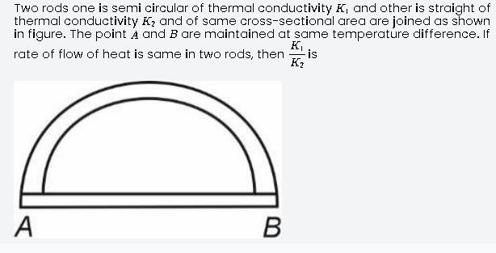
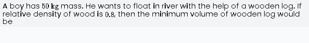
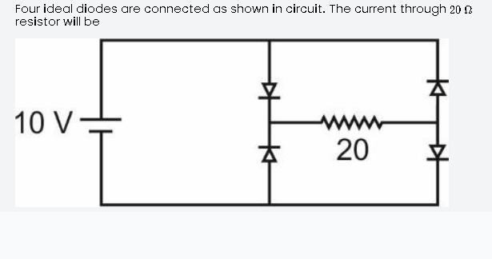
- [ ] In a moderately doped P-type semiconductor, the fermi energy level lies
-  [ ] 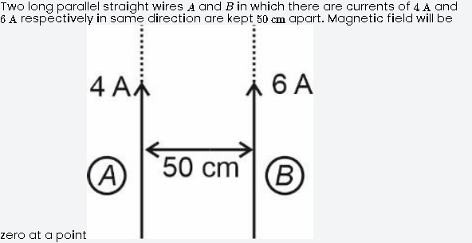
- [ ] A uniform potential gradient is established across a potentiometer wire. Two cells of emf E1 and E2 connected to support and oppose each other are balanced over I1=180 cm and 60 cm respectively. Value of E1E2 is
- [x] A charge +Q is at a distance L2 above the centre of a square plate having side L. Total flux linked with the square plate is
	Image: 
- [ ] 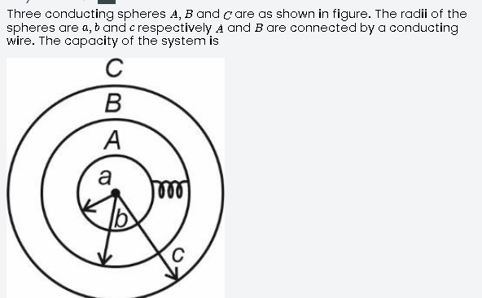
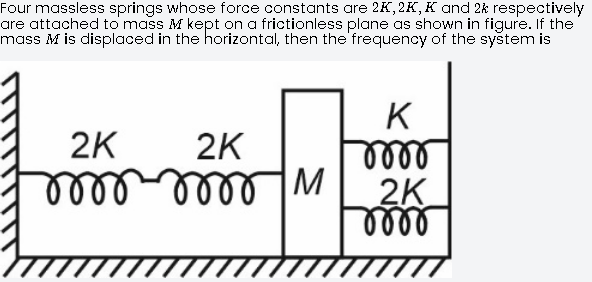
A block of wood floats in water with (45)th  of its volume submerged. If the same block just floats in a liquid, the density of the liquid (in kgm−3 ) is
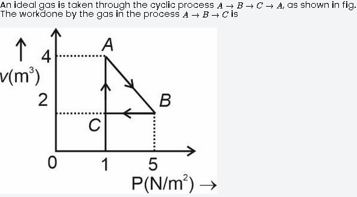
 A wire of length L and radius r rigidly fixed at one end. On stretching the other end of the wire with a force F, the increase in its length is l. If another wire of same material but of length 2L and radius 2r is stretched with a force 2F, the increase in its length will be
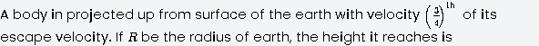
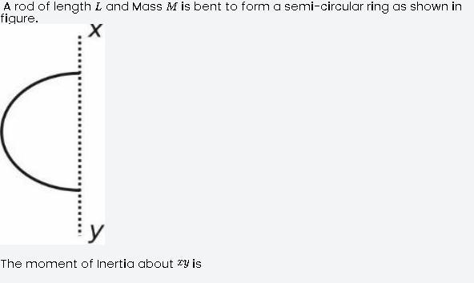
A ball impinges directly on a similar ball at rest. The first ball is brought to rest by the impact. If half of the kinetic energy is lost during impact, the value of coefficient of restitution is
A certain substance decays to 164th  of its initial activity in 24 days. The half-life of the substance will be
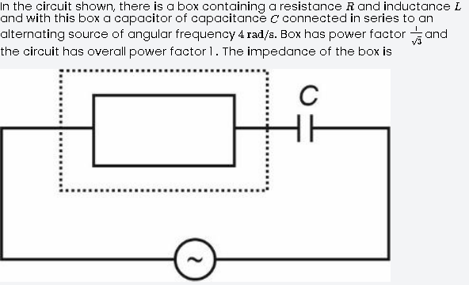
16
If a coil of 50 turns area 5.0 cm2 is suddenly removed from magnetic field. It is observed that charge of 5×10−4C flows into the coil. If the resistance of the coil is 100Ω, the magnetic flux density in Wb/m2 is
Current i is carried in a wire of length L. If the wire is turned into a circular coil. The maximum magnitude of torque acting on it, when placed in a given uniform magnetic field B, will be
11
Temperature of a body θ is slightly more than the temperature of the surrounding θ0, its rate of cooling (R) versus temperature of body (θ) is plotted, its shape would be (as per Newton's law of cooling)
 
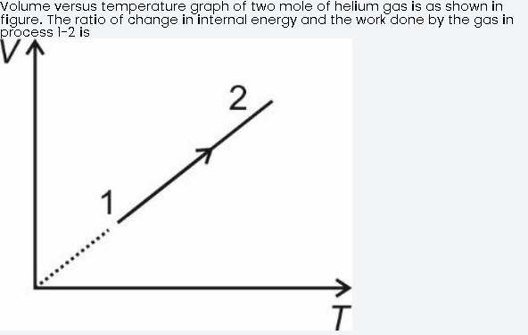
The gravitational field at some point in space is →g=3^i+4^j N/kg. The force exerted on a 2 kg mass placed at that point, is
A uniform rod AB of mass ' m ' length ' 2a ' is allowed to fall under gravity with AB in horizontal position. When the speed of rod is ' v ' suddenly the end ' A ' is fixed. The angular velocity of rod with which it begins to rotate will be
- [ ] If radius of gyration of a body about an axis passing through its centre of mass is 24 cm then radius of gyration of a body about an axis parallel to prior axis and at a distance 7 cm from centre of mass, will be
- [x] A ball falls vertically onto a floor, with momentum P, then bounces repeatedly. The coefficient of restitution is 12, the total momentum imparted by the ball to the floor is
	- 
- [x]  If R and h represents the horizontal range and maximum height respectively of an oblique projectile, then $\frac{R^2}{8h} + 2h$ represents
	
