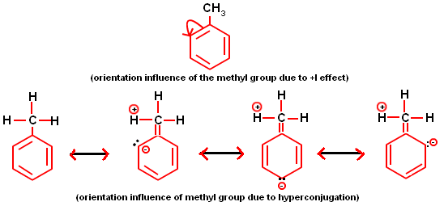

**Chapter**:  [Organic Chemistry  Some Basic Principles and Techniques](Organic%20Chemistry%20%20Some%20Basic%20Principles%20and%20Techniques.md)

**When does hyperconjugation occur ? : **   Whenever $C-H$ $\sigma$  bond is adjacent to a $sp^2$ carbon (in general), a phenomenon occurs known as hyperconjugation 

$sp^3$ Carbon - $\alpha C$

It is the $\sigma - e^{-}$ delocalization due to overlap of p-orbital of $sp^2$ hybridized carbon with adjacent $C-H$ $\sigma$ bond.  **( $\sigma - p$)**

*hyperconjugation increases the stabiity of carbocation*

Number of hyperconjugating structures involving C-H cleavage= = no. of alpha-hydrogen

Total number of hyper conjugating structures = alpha H + 1

## Types of Hyperconjugation

$\sigma - \text{odd} e^{-}$  hyperconjugation

## Types of Hyperconjugation

| Sacrificial                                                     | Isovalent                                                                               |
| --------------------------------------------------------------- | --------------------------------------------------------------------------------------- |
| The type of hyperconjugation where charge operation takes place | No charge hyperconjugation takes place                                                  |
| Example: $\sigma - \pi$ hyperconjugation                        | Example: $\sigma - (+)$ hyperconjugation $\sigma$ - odd $e^{-}$ hyperconjugation  |
- $CH_4$ shows $+H$ effect
- Hyperconjugation doesn't operate at meta position

1. **Positive Electromeric Effect (+E effect):** The positive electromeric effect is defined as the transfer of π−electrons of the multiple bonds to the atom with which the reagent gets attached.

2.  **Negative Electromeric Effect (–E effect):   The negative electromeric effect is defined as the transfer of π−electrons of the multiple bonds to the atom with which the reagent does not get attached.

## Applications
- stabilises carbocation
	- +H increases stability of carbocation
- stabilises alkene
	- +H increases stability of alkene
M > H > I

**Order of +H effect:**
$$-CH_{3} > - CH_{2}D > -CHD_{2} > -CD_{3} > -CD_{2}T > -CDT_{2} > -CDT_{3}$$

-H effect is shown by $-CX_3$ group, decreases electron density in conjugated system
-H effect does not operate at meta position
Order of -I effect: $-CI_3 > -CBr_3 > -CCl_3 > -CF_3$

Acidic strength $\propto$ stability of conjugate base : $-M - H -I > +I > +H > + M$
Basic strength: $+M > +H > +I > -I > -H > -M$